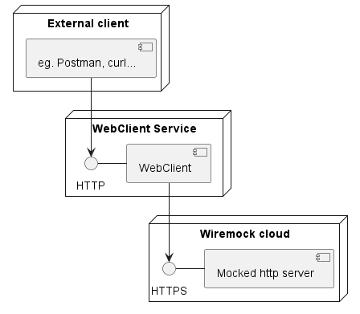

# A simple service using WebClient

The purpose of this project is to show-case, with a simple example, how to use [WebClient](https://docs.spring.io/spring-framework/docs/current/javadoc-api/org/springframework/web/reactive/function/client/WebClient.html)
(Spring Framework's reactive implementation of a http client) to communicate to an external service in an asynchronous
manner.

While keeping it simple, the service using `WebClient` implements retries, error handling and other features, to show
how to peek into the reactive sequence of events along the process of sending a request by making use of reactive
operators.

## API

The service exposes an API that communicates with [WIREMOCK Cloud](https://app.wiremock.cloud/), where the answers to
the requests sent to this service can be stubbed. Next figure represents shows the setup:



The API offers two endpoints:

* `/test/ok`
* `/test/fail`

Internally, the service performs the translation between these two endpoints and those exposed by WIREMOCK Cloud
instance, prior sending a http request to WIREMOCK Cloud.

## Wiremock Cloud

The Wiremock Cloud instance should be configured in this way, since the endpoints are hard-coded:

* `/mock/ok`, to reply with http status code 200 and with any jason payload in the body, or no body, if you prefer.
* `/mock/fail`, to replay with any faulty status code you want to test. Every time you want to test how the service
behaves on different http status codes, the WIREMOCK stub for this endpoint has to be modified accordingly.

See [Getting Started](https://docs.wiremock.io/getting-started/) section on WIREMOCK Cloud page.

## Tests

Tests are intended to demo three major aspects when dealing with reactive code:

1. The differences between `block()` and `subscribe()` or, in other words: "to block, or not to block, that is the
question".
2. Triggering the reactive flow with `subscribe()` and ways to provide callbacks in the subscription to handle both
successful and unsuccessful completion of the reactive flow.
3. Common errors and strategies to test asynchronous code.

Regarding the topic of strategies to test asynchronous code, refer to [Awaitility](http://www.awaitility.org/) library,
that implements a DSL that allows you to express expectations of an asynchronous system in a concise and easy to read
manner:

````java
@Test
public void updatesCustomerStatus() {
    // Publish an asynchronous message to a broker (e.g. RabbitMQ):
    messageBroker.publishMessage(updateCustomerStatusMessage);

    // Awaitility lets you wait until the asynchronous operation completes:
    await().atMost(5, SECONDS).until(customerStatusIsUpdated());
    ...
}
````
Tests can be executed with `mvn test`.


